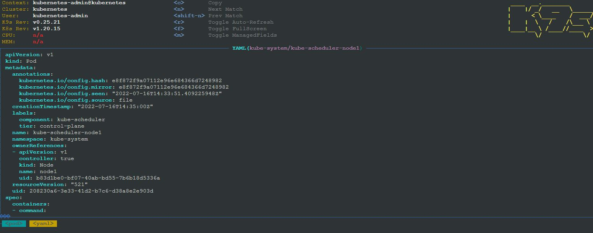

## 1 K8s
> <p>Palying  with k8s is a next step after docker and docker swarm.<br>
There are plenty of resources starting from local minikube or KIND  , or in the cloud like AWS GCP
K9s is a terminal based UI to interact with your Kubernetes clusters.

Too make it easier to navigate, observe and manage your deployed applications in the wild I started from K9s.
K9s continually watches Kubernetes for changes and offers subsequent commands to interact with your observed resources.

[K9s](https://github.com/derailed/k9s)
 _quickly installing  with_ 

 ```
 curl -sS https://webinstall.dev/k9s | bash
 ```



 ---

 
 


## 2.  Collecting and presenting logs in K8s environment( fluentd  installed as DeamonSet, Elasticsearch to visualise).

Once in the cluster there are couple of applications like database,python aplications,  message broker crosschecking all of them especially in real time could a challenge simple kubectl describe pod etc will not be enough. It is even worse if the one of them is not working then logs are essetial for debugging.


Now the question is how do application log this data?<b>
<br/>
There are few options:

* applications right to a file
however as you can imagine it's difficult to analyze
loads of data in raw log files

* another option could be to log directly
into a log database like elastic for example
to then have a visualization of this
data however in this case
each application developer must add a
library for elastic search and configure it to connect to elastic 

* third-party solution [Fluentd](https://github.com/fluent/fluentd) does that reliably meaning
if there is a network outage or data spikes this shouldn't mess up data collection.
It starts collecting logs from all the applications: it can be your own applications
third-party applications. All of it now these logs that fluentd collected will be of different forms  like json format, nginx format some custom format, and so on so fluentd will process them and reformat them into a uniform way. After fluentd processes them, in most cases the goal is to nicely visualize  and analyse them.
---


---
 
Fluentd can send these logs to any destination you want elasticsearch, mongodb, s3, kafka.
Maybe  you want your python application logs to go to mongodb storage for data analysis and all other application logs to go to elasticsearch.
You can actually very easily configure that routing in fluentd.

 ===
You could  install fluentd in kubernetes as a DaemonSet(_DaemonSet is a component that runs on each kubernetes node_). 

You can configure fluenty using a fluentd configuration file. It's very powerful in terms of processing and reformatting your data
fluentd has tons of plugins for different use cases
 you can define the data
sources these are all the applications
 you configure how
these data entries will be processed
line by line  you parse each log as an individual
key value pair
after that you can enrich the data using
record transformers
finally you have
the output where should the logs go
and for each such output target
there is a plugin like elasticsearch, mongodb
 
 

```
helm repo add fluent https://fluent.github.io/helm-charts
```

 ## 3.  Creating Data science environment based on K8s
 
 * Locally with the use of Hyper-V VM on Windows. Good guide how to do it is under this address
 https://www.nakivo.com/blog/run-linux-hyper-v <br/>
 * installation of [minikube](https://github.com/kubernetes/minikube)  <br/>
 
 Once minikube environment is ready we could start installing required parts: <br/>
 * OLM (Operator Lifecycle Manager)
  Operator Framework, an open source toolkit to manage Kubernetes native applications, called Operators, in an effective, automated, and scalable way
 
  https://github.com/operator-framework/operator-lifecycle-manager/releases/ <br/>
  For the time of writing this info latest release was as follows :<br/>
 
 ```
 curl -L https://github.com/operator-framework/operator-lifecycle-manager/releases/download/v0.21.2/install.sh -o install.sh
chmod +x install.sh
./install.sh v0.21.2
 ```
*  Keycloak  Keycloak, an open source software to provide authentication services.  The goal for 
this component is to provide a common single sign-on feature for all the platform 
components
 Good guide how to make everything work is under the link:
 [Keycloak](https://www.keycloak.org/getting-started/getting-started-kube) <br/>
 ---
 
 To make work more efficient importing realm to keycloak will be used:<br/>
 https://www.keycloak.org/operator/realm-import
 
 Importing directly from admin console realmsettings/Action( right)corner/ Partial import and giving path to json file with settings is good way 
 yo recreate configuration.
 
 Installing

Krew itself is a kubectl plugin that is installed and updated via Krew (yes, Krew self-hosts).

    ?? Warning: krew is only compatible with kubectl v1.12 or later.

    macOS/Linux: bash/zsh, fish
    Windows

macOS/Linux
Bash or ZSH shells

    Make sure that git is installed.

    Run this command to download and install krew:

    (
      set -x; cd "$(mktemp -d)" &&
      OS="$(uname | tr '[:upper:]' '[:lower:]')" &&
      ARCH="$(uname -m | sed -e 's/x86_64/amd64/' -e 's/\(arm\)\(64\)\?.*/\1\2/' -e 's/aarch64$/arm64/')" &&
      KREW="krew-${OS}_${ARCH}" &&
      curl -fsSLO "https://github.com/kubernetes-sigs/krew/releases/latest/download/${KREW}.tar.gz" &&
      tar zxvf "${KREW}.tar.gz" &&
      ./"${KREW}" install krew
    )

    Add the $HOME/.krew/bin directory to your PATH environment variable. To do this, update your .bashrc or .zshrc file and append the following line:

    export PATH="${KREW_ROOT:-$HOME/.krew}/bin:$PATH"

    and restart your shell.

    Run kubectl krew to check the installation.

### Status
Project is: _in progress_ 


### Contact
Created by: _lencz.sla@gmail.com_

